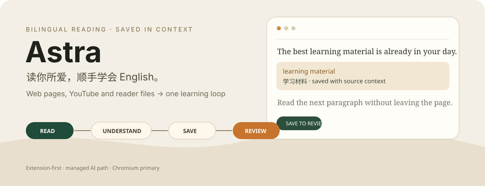
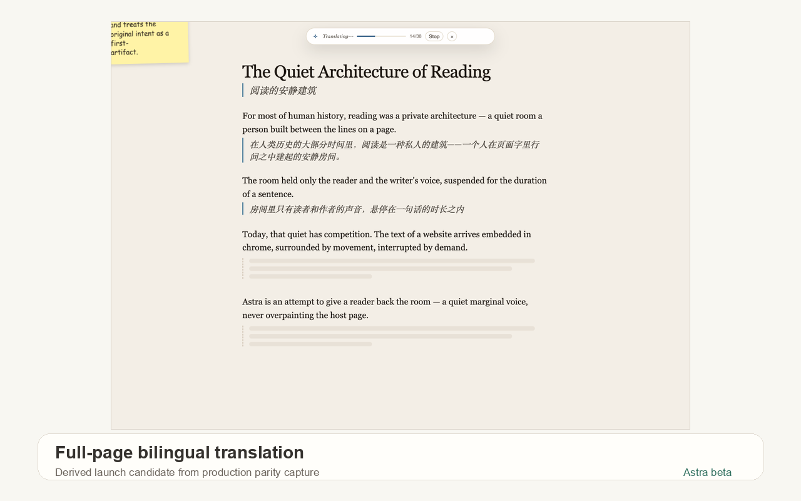
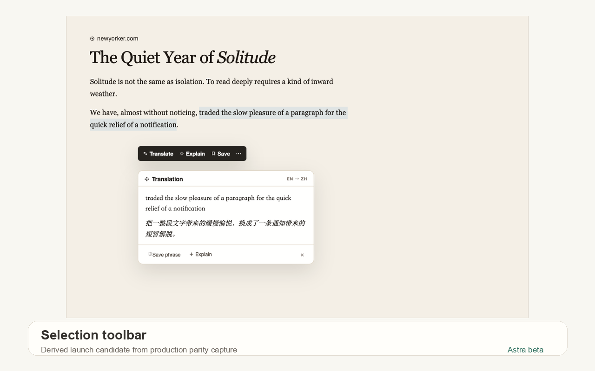
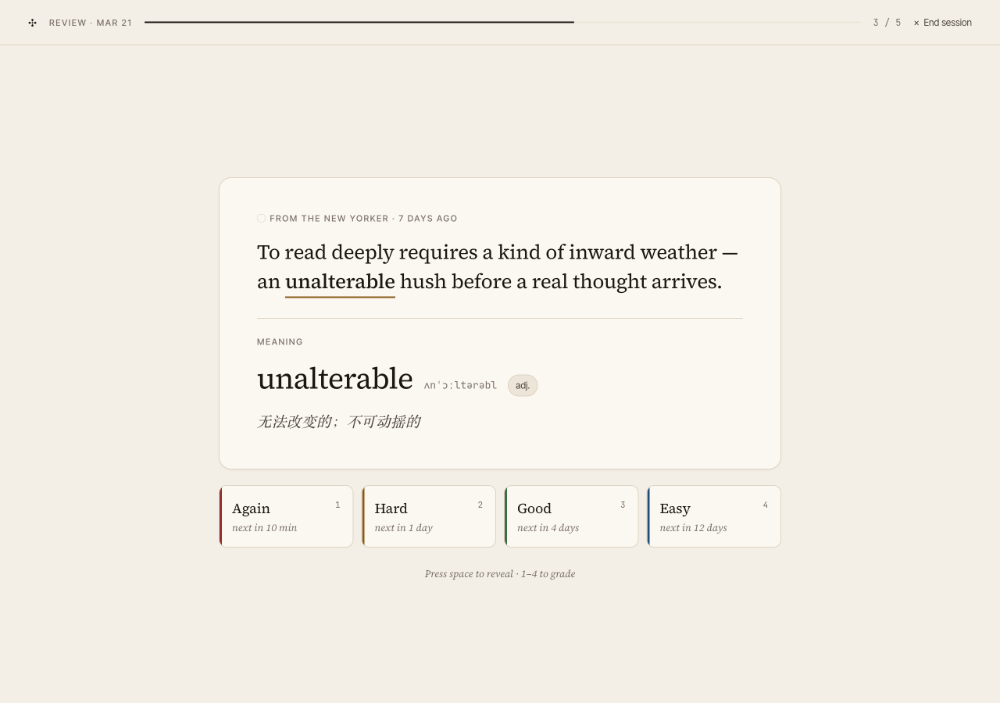
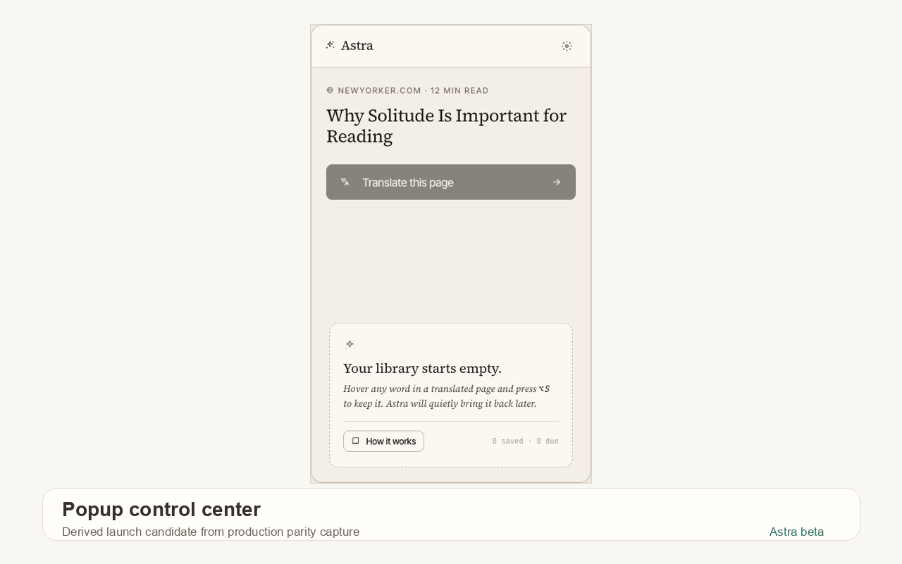

<p align="center">
  
</p>

# Astra

**读你所爱，顺手学会 English。** Astra 是一款以浏览器扩展为主的语言学习工具：在真实网页、受支持的视频和文档里双语阅读，把有用的词句连同来源上下文保存下来，再回到 Review 复习。

它不是模型控制台，也不要求普通用户配置 API。默认产品路径由 Astra 管理翻译与解释服务；本地 relay 是开发者 / 自托管入口。

## 先看实际界面

<p align="center">
  
  
</p>
<p align="center">
  
  
</p>

## 一条完整的学习链

| 阶段 | Astra 做什么 | 代码 / 证据入口 |
| --- | --- | --- |
| Read | 网页就地翻译、双语 / 仅译文、文章模式、站点规则 | `src/entrypoints/content/` |
| Understand | 划词与悬停解释，保留当前页面语境 | `src/entrypoints/content/`、`src/utils/providers/` |
| Save | 保存词语、句子和来源信息 | `src/utils/storage/vocabulary*.ts` |
| Review | 在 Review 中复习，重新连接原文上下文 | `src/entrypoints/vocabulary/`、`src/web/` |

当前有证明链的扩展面包括网页阅读、YouTube 字幕学习，以及 PDF、EPUB、SRT / VTT reader。其它视频适配器和更宽的文件格式即使代码存在，也不等于当前产品承诺；以 [支持矩阵](docs/investigations/support-matrix-2026-q2.md) 为准。

## 平台边界

| 平台 | 当前定位 |
| --- | --- |
| Chrome / Chromium | 主要开发与验证路径 |
| Firefox | Beta 构建路径 |
| Desktop Safari | Beta 打包路径 |
| iOS Safari shell | Experimental；不代表完整移动端对等 |

## 本地开发

需要 **Node.js 22+** 与 **pnpm 10+**。

```bash
pnpm install
pnpm dev
```

WXT 启动后，按终端提示加载开发扩展。生产构建：

```bash
pnpm build
# Chromium 产物：.output/chrome-mv3/
```

其它真实入口：

```bash
pnpm dev:web          # Web companion，默认 4173
pnpm relay:start      # 本地 relay，默认 8787
pnpm build:firefox
pnpm build:safari
```

Relay **只读取进程环境变量**，不会自动加载 `src/server/.env`。如需本地 provider key，请先导出变量再启动；详见 [`docs/relay-server.md`](docs/relay-server.md)。

## 验证

```bash
pnpm check:repo-knowledge
pnpm type-check
pnpm lint:ci
pnpm test
pnpm build
```

扩展加载型 live bench 还需要 Playwright Chromium；发布验证入口是：

```bash
pnpm build
npx playwright install chromium
pnpm bench:live:lane:release-proof
```

## 隐私边界

- 翻译与解释内容可能离开设备并由 Astra 管理的 AI 服务处理。
- `privacyMode` 是请求上下文清理，不是“纯本地 AI”承诺。
- 自托管 backend URL 属于你的信任边界，只应指向你控制或明确信任的服务。

## 仓库地图

```text
src/entrypoints/   浏览器扩展入口
src/utils/         provider、缓存、配置与学习数据
src/server/        Node relay
src/web/           React / Vite companion
src/platform/      Cloudflare / relay-lite
script/            维护、bench 与 release proof
apps/mobile/       移动端实验面
```

进一步阅读：[Docs](docs/README.md) · [Capability Matrix](docs/capability-matrix-v2.md) · [Product Roadmap](docs/product-roadmap.md) · [iOS / Safari](ios/README.md)

## License

仓库当前未包含顶层 license 文件；在明确复用或分发条款前，请先向维护者确认。
