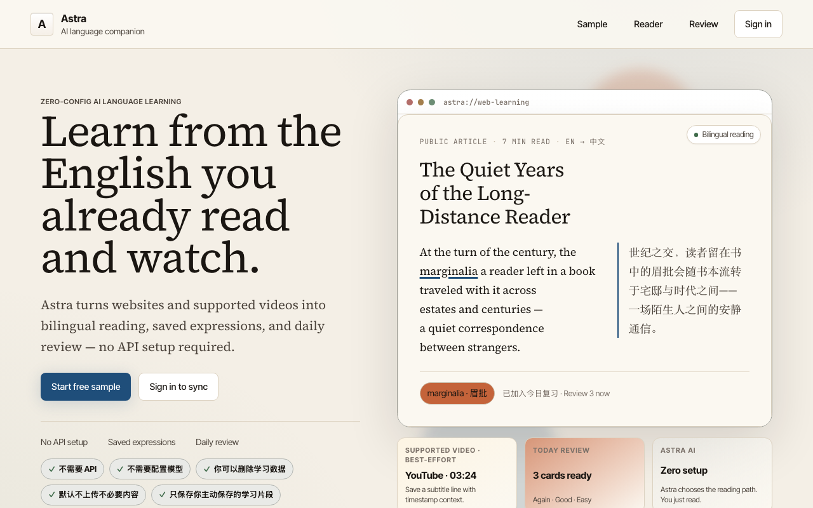

# ✦ Astra

<p align="center">
  
</p>

<p align="center">
  <strong>Learn from the English you already read and watch.</strong><br />
  Astra turns websites and supported videos into bilingual reading, saved expressions, and daily review — no API setup required.
</p>

<p align="center">
  <a href="docs/product-roadmap.md">Roadmap</a> ·
  <a href="docs/investigations/support-matrix-2026-q2.md">Support Matrix</a> ·
  <a href="docs/capability-matrix-v2.md">Capability Matrix</a> ·
  <a href="docs/README.md">Docs</a>
</p>

<p align="center">
  
  
  
  
  
</p>

Astra is not a model-control panel or another page translator. It is a zero-config learning layer: read a real page, save useful words and sentences, and review them later with source context attached.

Astra 的产品方向是“用户只管读和复习”：不需要 API、不需要配置模型，只把网页和受支持视频里的真实表达沉淀为可复习的学习资产。

## Preview

<p align="center">
  
</p>

<table>
  <tr>
    <td width="50%">
      
      <br />
      <strong>Page translation</strong><br />
      Read supported webpages with bilingual translation in place.
    </td>
    <td width="50%">
      
      <br />
      <strong>Save from the page</strong><br />
      Translate, explain, and save selected text without leaving the current page.
    </td>
  </tr>
  <tr>
    <td width="50%">
      
      <br />
      <strong>Daily review</strong><br />
      Turn saved expressions into lightweight review cards.
    </td>
    <td width="50%">
      
      <br />
      <strong>Zero-config control</strong><br />
      Astra keeps service details behind the scenes so ordinary users can just read.
    </td>
  </tr>
</table>

> Screenshot set uses root-level launch-candidate artifacts in `store/screenshots/`. `00-github-page-landing.png` is captured from the current Astra Web landing page at 1280×800; older parity captures are documented in `store/screenshots/README.md`.

## Why Astra

Most translation tools optimize for one moment: turn unreadable text into readable text.

Astra optimizes a longer loop:

1. **Read** — make real web pages understandable without breaking the page.
2. **Explain** — preserve enough context to understand why a translation means what it means.
3. **Save** — turn useful words, sentences, and reading moments into learning assets.
4. **Review** — connect daily browsing with lightweight long-term memory.

这也是为什么 Astra 先从浏览器插件切入：语言学习最缺的不是另一个课程入口，而是每天自然发生、低摩擦、真实上下文里的输入。

## What works today

Current high-confidence surfaces:

- **Page translation** — progressive batching, viewport priority, conservative DOM handling.
- **Bilingual / translation-only reading** — switch between study mode and fluent reading.
- **Selection toolbar** — translate and explain selected text in context.
- **Hover translation** — configurable trigger behavior for lower-interruption reading.
- **Input translation** — assist expression in everyday input fields.
- **Article mode** — prioritize main content and reduce noisy page regions.
- **Site rules** — enable/disable, auto-translate, target language, hover behavior, scope, and presentation style per site.
- **Subtitle translation (YouTube)** — proof-backed YouTube subtitle + transcript path: bilingual subtitles, seek-recovery, track-switch, click-to-jump, and save-a-line/word to Review with a click-to-replay timestamp. **YouTube is the only claimed video platform for the paid beta.** Other adapters (Bilibili, etc.) remain code-present but are not claimed, gated, or tested for beta. Transcript file export (bilingual / SRT / notes download) is intentionally not offered — Astra keeps source content in Review, not redistributed as files.
- **Controlled reader/file workflows** — PDF, EPUB, and SRT/VTT subtitle-file readers have proof-backed intake/reader lanes and in-reader confidence labels; ASS/Markdown/TXT/HTML parser support is opportunistic.
- **Astra-managed AI access** — users choose a reading style and target language; Astra handles service details behind the scenes.

Evolving surfaces:

- broader owned-reading reopen and cross-device document continuity
- vocabulary and review loop
- web companion workspace
- cross-surface continuity and sync
- Safari/iOS packaging path

For deeper status, use the [capability matrix](docs/capability-matrix-v2.md). It is evidence context, not a release-claim override.

## Platform support

| Platform | Status | Notes |
| --- | --- | --- |
| Chrome / Chromium | Supported primary path | Main development and validation target. |
| Firefox | Beta | Build and validation path exists; not equal maturity with Chromium. |
| Desktop Safari | Beta | Safari extension packaging path exists. |
| iOS Safari shell | Experimental | Host shell exists, but this is not full mobile product parity. |

**Video learning (paid beta scope):** YouTube only, proof-gated (`bench:live:lane:beta-proof`). Other video platforms are code-present but not claimed, not gated, and not in scope. No transcript file export.

Canonical support boundaries live in [`docs/investigations/support-matrix-2026-q2.md`](docs/investigations/support-matrix-2026-q2.md).

## Privacy and AI boundary

Astra translation and explanation requests are processed by Astra-managed AI services in the default product flow. Local development and self-hosted deployments can point the extension at their own trusted backend, but that is an operator/developer setup detail rather than an end-user requirement.

Important boundaries:

- Translation content can leave the device for translation or explanation.
- `privacyMode` means request-context sanitization; it is not a promise of local-only AI processing.
- If you self-host or use a development backend, its base URL is part of your trust boundary and should point to infrastructure you control or explicitly trust.

Detailed privacy and operator caveats are tracked in [`docs/investigations/month-6-privacy-routing-failure-inventory-2026-04-14.md`](docs/investigations/month-6-privacy-routing-failure-inventory-2026-04-14.md).

## Quick Start

Requires Node 22 and pnpm 10.

```bash
pnpm install

# Chrome / Chromium extension dev
pnpm dev

# Production extension build
pnpm build

# Firefox build
pnpm build:firefox

# Desktop Safari build / dev
pnpm build:safari
pnpm dev:safari

# Prepare iOS Safari shell resources
pnpm ios:prepare

# Developer/operator only: local relay server
pnpm relay:start

# Web companion
pnpm dev:web
pnpm build:web

# Repository guardrail and validation
pnpm check:repo-knowledge
pnpm type-check
pnpm lint
pnpm test
```

Load the Chromium build from `.output/chrome-mv3/` as an unpacked extension.

For normal extension use, Astra presents a managed AI service path rather than asking users to configure providers or models. Developer/operator setup for the local relay is documented in [`docs/relay-server.md`](docs/relay-server.md) and [`src/server/.env.example`](src/server/.env.example).

## Architecture

Astra is organized around stable, indexable repo knowledge:

```text
src/      product/runtime source
script/   maintenance, benchmark, and optimizer scripts
docs/     source of truth for repo knowledge and planning
data/     generated/runtime/reference outputs
```

Current product surfaces:

```text
src/entrypoints/       WXT extension entrypoints
src/utils/             extension runtime utilities
src/components/        shared extension UI pieces
src/server/            Astra relay server
src/web/               React/Vite web companion
src/platform/          Cloudflare and relay-lite platform code
script/maintenance/    repo checks and maintenance scripts
script/bench*/         deterministic, live, and optimizer harnesses
```

The repo knowledge guardrail rejects tracked files drifting back into legacy top-level roots:

```bash
pnpm check:repo-knowledge
```

## Roadmap

- **Now: daily-use translation** — stable page translation, low-interruption interactions, article mode, site rules, and managed Astra AI access.
- **Now: proof-backed learning loop** — save useful words/sentences, preserve context, and review them from Vocabulary/Review.
- **Now: proof-backed reader/video surfaces** — PDF, EPUB, SRT/VTT subtitle-file, and YouTube learning-workspace proof lanes exist; broader platform and document-format claims (including ASS/Markdown/TXT/HTML parser convenience paths) stay scoped by the support matrix.
- **Next: ecosystem maturity** — browser, reading, video, vocabulary, progress, sync, and future subscription surfaces connected into one product after the required billing/legal work is complete.

See [`docs/product-roadmap.md`](docs/product-roadmap.md) for the fuller direction.

## Contributing

Astra is a language-learning product, not a generic model-control panel. Before proposing broad product changes, read:

- [`docs/README.md`](docs/README.md)
- [`docs/product-roadmap.md`](docs/product-roadmap.md)
- [`docs/investigations/support-matrix-2026-q2.md`](docs/investigations/support-matrix-2026-q2.md)
- [`docs/capability-matrix-v2.md`](docs/capability-matrix-v2.md)
- [`docs/bench-harness.md`](docs/bench-harness.md)
- [`docs/relay-server.md`](docs/relay-server.md)
- [`ios/README.md`](ios/README.md)

## License

MIT
