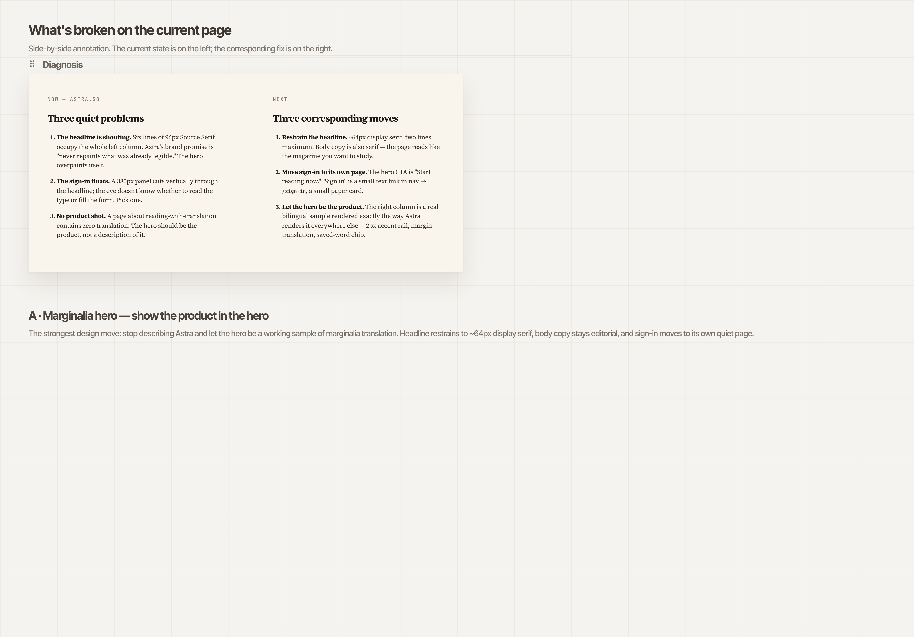
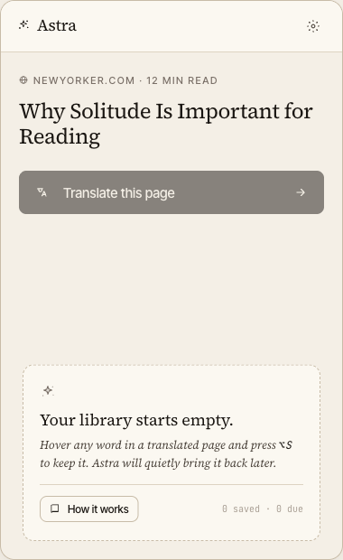
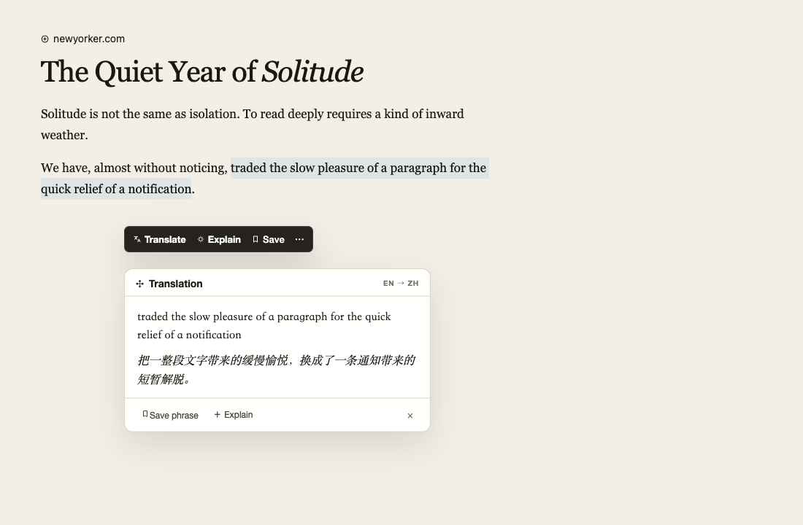
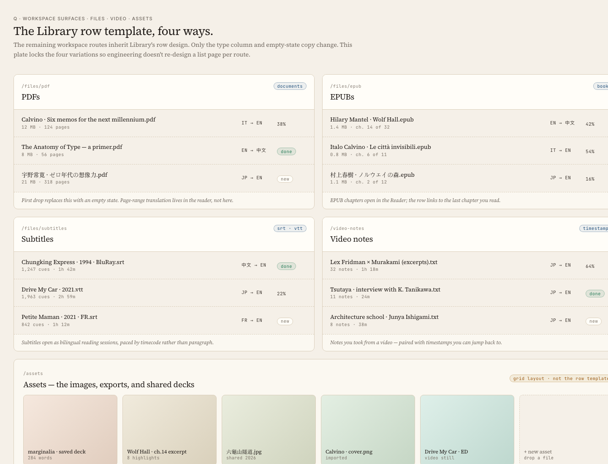

# ✦ Astra

<p align="center">
  
</p>

<p align="center">
  <strong>AI-powered language learning layer for the web.</strong><br />
  为中文用户阅读英文网页而设计的浏览器学习层。
</p>

<p align="center">
  <a href="docs/product-roadmap.md">Roadmap</a> ·
  <a href="docs/investigations/support-matrix-2026-q2.md">Support Matrix</a> ·
  <a href="docs/capability-matrix-v2.md">Capability Matrix</a> ·
  <a href="docs/README.md">Docs</a>
</p>

<p align="center">
  
  
  
  
  
</p>

Astra is not just another page translator. It starts with low-friction browser translation, then turns daily reading into explanation, review, and long-term language-learning assets.

Astra 现在最强的是“读懂”和“解释”：整页翻译、双语阅读、划词解释、悬停翻译、输入框翻译、文章模式、站点规则和字幕翻译。词汇沉淀、复习、阅读历史、PDF/EPUB/视频等能力正在演进中，不在 README 里夸大成已经完全成熟的生态。

## Preview

<p align="center">
  
</p>

<table>
  <tr>
    <td width="50%">
      
      <br />
      <strong>Extension control surface</strong><br />
      Configure reading and translation behavior close to the page.
    </td>
    <td width="50%">
      
      <br />
      <strong>Selection translation</strong><br />
      Translate and explain selected text without leaving the current page.
    </td>
  </tr>
  <tr>
    <td width="50%">
      
      <br />
      <strong>Review loop</strong><br />
      Early learning-loop surface for turning reading into review material.
    </td>
    <td width="50%">
      
      <br />
      <strong>Reader surfaces</strong><br />
      Web companion surfaces for owned reading workflows under active development.
    </td>
  </tr>
</table>

> Screenshot set is drawn from current production/parity captures under `store/screenshots/ui-parity-2026-05-13/production/`. Design references live under `docs/design-comparison/` and are not presented here as shipped product UI.

## Why Astra

Most translation tools optimize for one moment: turn unreadable text into readable text.

Astra optimizes a longer loop:

1. **Read** — make real web pages understandable without breaking the page.
2. **Explain** — preserve enough context to understand why a translation means what it means.
3. **Save** — turn useful words, sentences, and reading moments into learning assets.
4. **Review** — connect daily browsing with lightweight long-term memory.

这也是为什么 Astra 先从浏览器插件切入：语言学习最缺的不是另一个课程入口，而是每天自然发生、低摩擦、真实上下文里的输入。

## What works today

Current high-confidence surfaces:

- **Page translation** — progressive batching, viewport priority, conservative DOM handling.
- **Bilingual / translation-only reading** — switch between study mode and fluent reading.
- **Selection toolbar** — translate and explain selected text in context.
- **Hover translation** — configurable trigger behavior for lower-interruption reading.
- **Input translation** — assist expression in everyday input fields.
- **Article mode** — prioritize main content and reduce noisy page regions.
- **Site rules** — enable/disable, auto-translate, target language, hover behavior, scope, and presentation style per site.
- **Subtitle translation** — works with page-accessible subtitle or caption tracks where the browser can read them.
- **Provider routing** — Google Translate, OpenAI, and Gemini direct provider paths, plus Astra relay support and direct → relay fallback.

Evolving surfaces:

- PDF / EPUB / owned reading workflows
- vocabulary and review loop
- web companion workspace
- cross-surface continuity and sync
- Safari/iOS packaging path

For deeper status, use the [capability matrix](docs/capability-matrix-v2.md). It is evidence context, not a release-claim override.

## Platform support

| Platform | Status | Notes |
| --- | --- | --- |
| Chrome / Chromium | Supported primary path | Main development and validation target. |
| Firefox | Beta | Build and validation path exists; not equal maturity with Chromium. |
| Desktop Safari | Beta | Safari extension packaging path exists. |
| iOS Safari shell | Experimental | Host shell exists, but this is not full mobile product parity. |

Canonical support boundaries live in [`docs/investigations/support-matrix-2026-q2.md`](docs/investigations/support-matrix-2026-q2.md).

## Privacy and AI provider boundary

Astra can run through two outbound paths:

- **Direct provider** — your configured provider credentials call the provider directly. Google Translate uses Cloud Translation Basic v2 (`nmt`).
- **Astra relay** — requests go through an Astra-managed or self-hosted relay. Current defaults put accounts on the free plan with Google Translate, OpenAI, and Gemini entitlements.

Important boundaries:

- Translation content can leave the device through direct provider or relay paths.
- `privacyMode` means request-context sanitization; it is not a promise of local-only AI processing.
- If direct provider credentials and Astra relay/session are both configured, runtime fallback may change transport after direct provider failure.
- `relayBaseURL` is part of your trust boundary and should point to a relay you control or explicitly trust.

Detailed privacy/routing caveats are tracked in [`docs/investigations/month-6-privacy-routing-failure-inventory-2026-04-14.md`](docs/investigations/month-6-privacy-routing-failure-inventory-2026-04-14.md).

## Quick Start

Requires Node 22 and pnpm 10.

```bash
pnpm install

# Chrome / Chromium extension dev
pnpm dev

# Production extension build
pnpm build

# Firefox build
pnpm build:firefox

# Desktop Safari build / dev
pnpm build:safari
pnpm dev:safari

# Prepare iOS Safari shell resources
pnpm ios:prepare

# Astra relay server
pnpm relay:start

# Web companion
pnpm dev:web
pnpm build:web

# Repository guardrail and validation
pnpm check:repo-knowledge
pnpm type-check
pnpm lint
pnpm test
```

Load the Chromium build from `.output/chrome-mv3/` as an unpacked extension.

For relay configuration, see [`src/server/.env.example`](src/server/.env.example) and [`docs/relay-server.md`](docs/relay-server.md). The relay reads `process.env`; export provider keys such as `GOOGLE_TRANSLATE_API_KEY` before `pnpm relay:start`.

## Architecture

Astra is organized around stable, indexable repo knowledge:

```text
src/      product/runtime source
script/   maintenance, benchmark, and optimizer scripts
docs/     source of truth for repo knowledge and planning
data/     generated/runtime/reference outputs
```

Current product surfaces:

```text
src/entrypoints/       WXT extension entrypoints
src/utils/             extension runtime utilities
src/components/        shared extension UI pieces
src/server/            Astra relay server
src/web/               React/Vite web companion
src/platform/          Cloudflare and relay-lite platform code
script/maintenance/    repo checks and maintenance scripts
script/bench*/         deterministic, live, and optimizer harnesses
```

The repo knowledge guardrail rejects tracked files drifting back into legacy top-level roots:

```bash
pnpm check:repo-knowledge
```

## Roadmap

- **Now: daily-use translation** — stable page translation, low-interruption interactions, article mode, site rules, provider routing.
- **Next: learning loop** — save useful words/sentences, preserve context, build review material.
- **Later: owned reading/video surfaces** — PDF, EPUB, video subtitles, web companion workspace, continuity.
- **Ecosystem: multi-surface learning system** — browser, reading, video, vocabulary, progress, sync, and subscription surfaces connected into one product.

See [`docs/product-roadmap.md`](docs/product-roadmap.md) for the fuller direction.

## Contributing

Astra is a language-learning product, not a generic model-control panel. Before proposing broad product changes, read:

- [`docs/README.md`](docs/README.md)
- [`docs/product-roadmap.md`](docs/product-roadmap.md)
- [`docs/investigations/support-matrix-2026-q2.md`](docs/investigations/support-matrix-2026-q2.md)
- [`docs/capability-matrix-v2.md`](docs/capability-matrix-v2.md)
- [`docs/bench-harness.md`](docs/bench-harness.md)
- [`docs/relay-server.md`](docs/relay-server.md)
- [`ios/README.md`](ios/README.md)

## License

MIT
