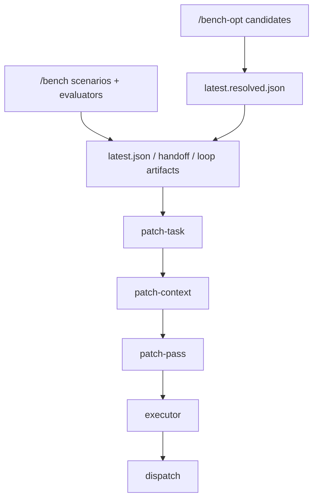
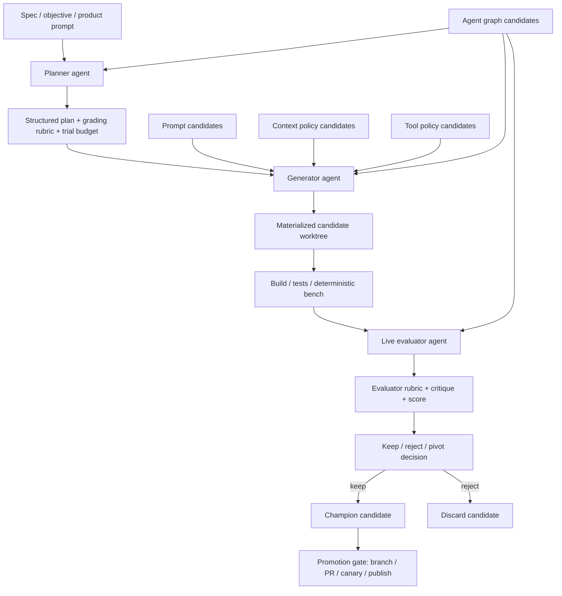

# Astra Roadmap: From Current Bench to an Anthropic-Style Long-Running Agent Harness

_Last updated: 2026-03-26_

## Sources and scope

Primary external references used for this roadmap:

- Anthropic engineering post: [Harness design for long-running application development](https://www.anthropic.com/engineering/harness-design-long-running-apps) — accessed 2026-03-26.
- Karpathy repo: [karpathy/autoresearch](https://github.com/karpathy/autoresearch) — README accessed 2026-03-26.

Primary Astra implementation references used for this roadmap:

- `/Users/ruirui/Downloads/GitHub/Astra/docs/bench-harness.md`
- `/Users/ruirui/Downloads/GitHub/Astra/docs/bench-opt.md`
- `/Users/ruirui/Downloads/GitHub/Astra/bench/executors/openai.ts`
- `/Users/ruirui/Downloads/GitHub/Astra/bench/dispatch-entry.ts`
- `/Users/ruirui/Downloads/GitHub/Astra/bench/loop-entry.ts`
- `/Users/ruirui/Downloads/GitHub/Astra/bench/reporters/patch-task.ts`
- `/Users/ruirui/Downloads/GitHub/Astra/bench/reporters/patch-context.ts`
- `/Users/ruirui/Downloads/GitHub/Astra/bench/reporters/executor.ts`
- `/Users/ruirui/Downloads/GitHub/Astra/bench/reporters/dispatch.ts`
- `/Users/ruirui/Downloads/GitHub/Astra/bench/optimizer-config.ts`
- `/Users/ruirui/Downloads/GitHub/Astra/bench-opt/runner.ts`
- `/Users/ruirui/Downloads/GitHub/Astra/bench-opt/worktree.ts`

---

## Important constraint: “100% Anthropic parity” is not a literal engineering target

This file cannot honestly guarantee literal 100% equivalence to Anthropic’s internal harness.

Reasons:

1. The Anthropic article is a high-level engineering write-up, not a full implementation spec.
2. Some behaviors are model-dependent and org-process-dependent.
3. Some capabilities depend on external infrastructure not present in this repo today: live app environments, experiment scheduling, branch/PR automation, artifact databases, canary/promotion systems.

Therefore this roadmap defines a **practical Definition of Done**:

> Astra is considered “Anthropic-style” when it has a stable planner/generator/evaluator architecture, a real execution loop, skeptical external evaluation, long-running iteration with compaction/reset strategy, structured handoff artifacts, live app evaluation where needed, and a candidate-based optimizer that can mutate prompt/context/tool/graph policies and promote improvements through controlled gates.

If you implement everything in this file, Astra will be functionally in the same class of system, even if not byte-for-byte equivalent to Anthropic’s internal harness.

---

## Executive summary

### Current Astra status

Astra already has a strong **judge and repair-advisory foundation**:

- deterministic scenario evaluator harness in `/Users/ruirui/Downloads/GitHub/Astra/bench/`
- structured handoff / loop / patch-task / patch-context / patch-pass / executor / dispatch artifacts
- history-aware ranking and gate summaries
- early optimizer layer in `/Users/ruirui/Downloads/GitHub/Astra/bench-opt/`
- structured prompt/context candidate configs with runtime policy hooks

### What Astra still lacks relative to Anthropic-style long-running harnesses

The largest missing pieces are:

1. **No real execute-apply-rerun-keep/reject loop**
2. **No dedicated planner/generator/evaluator agent orchestration runtime**
3. **No real live app evaluator loop for coding tasks**
4. **No experiment manager with train/validation/holdout splits**
5. **No candidate mutation pipeline for tools / agent graph / context policy beyond simple config selection**
6. **No controlled promotion pipeline to branch / PR / publish / rollback**

### Distance estimate

These are directional engineering estimates, not scientific metrics.

- Current Astra vs “repair advisory harness”: **~75% complete**
- Current Astra vs “Anthropic-style long-running coding harness”: **~40% complete**
- Current Astra vs “self-optimizing agent platform”: **~20% complete**

The missing 60–80% is concentrated in runtime execution, experiment management, live evaluation, and promotion infrastructure.

---

## What Anthropic-style harnesses appear to do that Astra does not yet do

Based on the Anthropic article as accessed on 2026-03-26, the relevant traits are:

1. **Separate planner, generator, evaluator roles**
2. **Structured artifacts passed between roles and sessions**
3. **Long-running multi-hour iteration loops**
4. **Explicit handling of context growth via compaction or reset strategy**
5. **Evaluator separated from generator to reduce self-evaluation bias**
6. **Evaluator grounded in direct interaction with the live artifact**
   - e.g. evaluator browsing with Playwright, inspecting the real app
7. **Iteration policy**
   - refine current direction when trend is good
   - pivot when trend is bad
8. **Grading criteria / rubrics made explicit and reusable**
9. **A loop that produces actual improved artifacts, not only advice**

Astra currently has solid coverage of items 2 and parts of 4/8, but not 1/3/6/7/9 in full.

---

## What `autoresearch` does that Astra does not yet do

Based on `autoresearch` README as accessed on 2026-03-26, the relevant traits are:

1. Agent edits a real file under a constrained scope
2. Runs a fixed-budget experiment
3. Compares a clear metric
4. Keeps or discards the change
5. Repeats overnight autonomously
6. Treats the “research org instructions” as an optimization target themselves

Astra currently has:

- score reports
- candidate prompt/context policy selection
- worktree planning

Astra does **not** yet have:

- automatic materialization into a real modifiable worktree
- experiment execution against a stable metric with keep/discard
- overnight autonomous trial scheduling
- candidate lineage and champion/challenger management

---

## Current Astra architecture and the gap



This is good as a **judge + advisory stack**.

It is not yet a full **long-running self-improving coding harness** because the bottom half still ends at “propose a patch” rather than “apply, test, compare, retain, promote”.

---

## Hard gap analysis

### Gap A — execution loop is advisory, not generative

Current evidence:

- `/Users/ruirui/Downloads/GitHub/Astra/bench/executors/openai.ts`
  - executor system prompt explicitly says: do not claim you edited files; only propose patch attempt.
- `/Users/ruirui/Downloads/GitHub/Astra/bench/dispatch-entry.ts`
  - dispatch writes response artifacts but does not apply edits or rerun evaluation.

Required change:

- Add a real execution layer that can:
  - materialize candidate worktree
  - apply structured edits
  - rerun judge harness
  - compare against previous run
  - keep/reject candidate

### Gap B — no true planner/generator/evaluator runtime

Current evidence:

- `/Users/ruirui/Downloads/GitHub/Astra/bench/loop-entry.ts`
  - loop constructs artifacts, but there is no runtime scheduler for planner → generator → evaluator turns.
- `/Users/ruirui/Downloads/GitHub/Astra/docs/bench-harness.md`
  - current workflow remains evaluator-first advisory loop.

Required change:

- Introduce explicit agent roles and artifact contracts:
  - planner
  - generator
  - evaluator
  - optional reviewer/verifier/promoter

### Gap C — no live evaluator for application correctness/usability

Current evidence:

- `/Users/ruirui/Downloads/GitHub/Astra/bench/` is mostly deterministic and mock-backed.
- `/Users/ruirui/Downloads/GitHub/Astra/bench/reporters/dispatch.ts`
  - dispatch consumes patch context markdown, not a live application inspection transcript.
- `/Users/ruirui/Downloads/GitHub/Astra/bench-live/`
  - live result contract now exists and `/Users/ruirui/Downloads/GitHub/Astra/bench-opt/runner.ts`
    can opt-in to execute it and persist `latest.live.json` / `latest.live.md`.

Required change:

- Add live app evaluation tier with real browser/runtime tools.
- Evaluator must inspect the actual running system, not only static artifacts.

### Gap D — no experiment manager

Current evidence:

- `/Users/ruirui/Downloads/GitHub/Astra/bench-opt/runner.ts`
  - chooses best current candidate heuristically, but does not track trial lineage or keep/reject outcomes.
- `/Users/ruirui/Downloads/GitHub/Astra/bench-opt/worktree.ts`
  - worktree output is still dry-run.

Required change:

- Add experiment DB/filesystem registry for:
  - candidate lineage
  - trial config
  - trial result
  - champion
  - challenger
  - retained / rejected / promoted status

### Gap E — no holdout discipline, so optimizer can overfit the judge

Current evidence:

- `/Users/ruirui/Downloads/GitHub/Astra/bench-opt/` currently optimizes against the current bench baseline directly.

Required change:

- Split scenarios into:
  - train
  - validation
  - holdout
- Promotion should never depend only on train split.

### Gap F — no real promotion pipeline

Current evidence:

- `/Users/ruirui/Downloads/GitHub/Astra/bench-opt/worktree.ts`
  - dry-run plan only.
- No PR/publish/rollback infrastructure exists in repo-local harness code.

Required change:

- Add branch/PR/publish gates.
- Add rollback and canary path.

---

## Target architecture



---

## Complete repository change plan

This is the full Astra-local change set I would treat as necessary to reach the target state.

## Phase 0 — Freeze the judge and define optimizer boundaries

### Goal

Stop the optimizer from self-corrupting the benchmark.

### Existing files to modify

- `/Users/ruirui/Downloads/GitHub/Astra/docs/bench-harness.md`
- `/Users/ruirui/Downloads/GitHub/Astra/docs/bench-opt.md`
- `/Users/ruirui/Downloads/GitHub/Astra/bench/run.ts`
- `/Users/ruirui/Downloads/GitHub/Astra/bench/types.ts`

### New files to add

- `/Users/ruirui/Downloads/GitHub/Astra/bench/splits.ts`
- `/Users/ruirui/Downloads/GitHub/Astra/bench/splits.json`

### Required changes

- Mark `/bench/` as the **judge harness**.
- Split scenarios into:
  - train
  - validation
  - holdout
- Add split metadata to scenario registry.
- Add CLI support:
  - `pnpm bench -- --split train`
  - `pnpm bench -- --split validation`
  - `pnpm bench -- --split holdout`
- Ban optimizer from mutating judge scenarios/evaluators in the same experiment loop.

### Acceptance criteria

- Bench can run per split.
- Optimizer promotion logic can require validation/holdout improvement.

---

## Phase 1 — Turn `bench-opt` from scorer into experiment manager

### Goal

Move from “best candidate summary” to “trial system”.

### Existing files to modify

- `/Users/ruirui/Downloads/GitHub/Astra/bench-opt/types.ts`
- `/Users/ruirui/Downloads/GitHub/Astra/bench-opt/runner.ts`
- `/Users/ruirui/Downloads/GitHub/Astra/bench-opt/worktree.ts`
- `/Users/ruirui/Downloads/GitHub/Astra/docs/bench-opt.md`
- `/Users/ruirui/Downloads/GitHub/Astra/package.json`

### New files to add

- `/Users/ruirui/Downloads/GitHub/Astra/bench-opt/experiments.ts`
- `/Users/ruirui/Downloads/GitHub/Astra/bench-opt/store.ts`
- `/Users/ruirui/Downloads/GitHub/Astra/bench-opt/champion.ts`
- `/Users/ruirui/Downloads/GitHub/Astra/bench-opt/compare.ts`
- `/Users/ruirui/Downloads/GitHub/Astra/bench-opt/keep-reject.ts`
- `/Users/ruirui/Downloads/GitHub/Astra/bench-opt/results/README.md`

### Required changes

- Persist every trial as a durable object:
  - candidate ids
  - parent trial id
  - split results
  - cost / latency / token usage
  - retained/rejected/promoted status
- Track a champion candidate.
- Track challenger candidates.
- Add lineage metadata.
- Add trial budget config.

### Acceptance criteria

- A single optimizer run can produce multiple durable trials.
- Champion/challenger comparison is explicit.

---

## Phase 2 — Real materialization and apply loop

### Goal

Make the optimizer capable of real code changes, not only advisory output.

### Existing files to modify

- `/Users/ruirui/Downloads/GitHub/Astra/bench-opt/worktree.ts`
- `/Users/ruirui/Downloads/GitHub/Astra/bench-opt/runner.ts`
- `/Users/ruirui/Downloads/GitHub/Astra/bench/dispatch-entry.ts`
- `/Users/ruirui/Downloads/GitHub/Astra/bench/executors/openai.ts`
- `/Users/ruirui/Downloads/GitHub/Astra/bench/reporters/executor.ts`
- `/Users/ruirui/Downloads/GitHub/Astra/bench/reporters/dispatch.ts`
- `/Users/ruirui/Downloads/GitHub/Astra/package.json`

### New files to add

- `/Users/ruirui/Downloads/GitHub/Astra/bench-opt/materialize.ts`
- `/Users/ruirui/Downloads/GitHub/Astra/bench-opt/apply.ts`
- `/Users/ruirui/Downloads/GitHub/Astra/bench-opt/rerun.ts`
- `/Users/ruirui/Downloads/GitHub/Astra/bench-opt/verify.ts`
- `/Users/ruirui/Downloads/GitHub/Astra/bench-opt/cleanup.ts`

### Required changes

- Replace dry-run-only worktree planning with optional real worktree creation.
- Require edits to be returned in structured form:
  - file
  - change type
  - patch body
  - write scope justification
- Apply patches in isolated worktree.
- Re-run:
  - build
  - tests
  - bench split(s)
- Compute delta against baseline.
- Keep or reject automatically.

### Acceptance criteria

- A candidate can be materialized, edited, tested, benchmarked, and judged without human intervention.

---

## Phase 3 — Add explicit planner / generator / evaluator orchestration

### Goal

Match the Anthropic-style role separation.

### Existing files to modify

- `/Users/ruirui/Downloads/GitHub/Astra/bench/loop-entry.ts`
- `/Users/ruirui/Downloads/GitHub/Astra/bench/loop.ts`
- `/Users/ruirui/Downloads/GitHub/Astra/bench/types.ts`
- `/Users/ruirui/Downloads/GitHub/Astra/bench/reporters/loop.ts`
- `/Users/ruirui/Downloads/GitHub/Astra/bench/reporters/patch-task.ts`
- `/Users/ruirui/Downloads/GitHub/Astra/bench/reporters/patch-pass.ts`
- `/Users/ruirui/Downloads/GitHub/Astra/bench/reporters/executor.ts`

### New files to add

- `/Users/ruirui/Downloads/GitHub/Astra/bench-opt/planner.ts`
- `/Users/ruirui/Downloads/GitHub/Astra/bench-opt/generator.ts`
- `/Users/ruirui/Downloads/GitHub/Astra/bench-opt/evaluator.ts`
- `/Users/ruirui/Downloads/GitHub/Astra/bench-opt/orchestrator.ts`
- `/Users/ruirui/Downloads/GitHub/Astra/bench-opt/artifacts.ts`

### Required changes

- Planner responsibilities:
  - decompose objective
  - allocate trial budget
  - define rubric
  - define refine vs pivot policy
- Generator responsibilities:
  - make candidate change
  - operate inside worktree
- Evaluator responsibilities:
  - judge result independently
  - emit skeptical critique
  - recommend refine/pivot/stop

### Acceptance criteria

- Planner/generator/evaluator are separate runtime roles with separate prompts and artifacts.

---

## Phase 4 — Add real long-running session behavior

### Goal

Support multi-hour autonomous work.

### Existing files to modify

- `/Users/ruirui/Downloads/GitHub/Astra/bench-opt/orchestrator.ts` (new, then evolve)
- `/Users/ruirui/Downloads/GitHub/Astra/docs/bench-opt.md`

### New files to add

- `/Users/ruirui/Downloads/GitHub/Astra/bench-opt/session.ts`
- `/Users/ruirui/Downloads/GitHub/Astra/bench-opt/compaction.ts`
- `/Users/ruirui/Downloads/GitHub/Astra/bench-opt/handoff.ts`
- `/Users/ruirui/Downloads/GitHub/Astra/bench-opt/checkpoints.ts`

### Required changes

- Add session persistence.
- Add explicit context strategy:
  - compaction
  - fresh-session reset with handoff
- Add checkpoint/resume.
- Add max wall-clock budget and max iteration budget.

### Acceptance criteria

- A run can continue for hours and survive context reset or process restart.

---

## Phase 5 — Add live evaluator environment

### Goal

Evaluator must inspect the real running artifact, not just static patches.

### Existing files to modify

- `/Users/ruirui/Downloads/GitHub/Astra/docs/bench-harness.md`
- `/Users/ruirui/Downloads/GitHub/Astra/docs/bench-opt.md`
- `/Users/ruirui/Downloads/GitHub/Astra/package.json`

### New files to add

- `/Users/ruirui/Downloads/GitHub/Astra/bench-live/index.ts`
- `/Users/ruirui/Downloads/GitHub/Astra/bench-live/runtime.ts`
- `/Users/ruirui/Downloads/GitHub/Astra/bench-live/evaluator.ts`
- `/Users/ruirui/Downloads/GitHub/Astra/bench-live/rubrics.ts`
- `/Users/ruirui/Downloads/GitHub/Astra/bench-live/scenarios/`
- `/Users/ruirui/Downloads/GitHub/Astra/bench-opt/evaluate-live.ts`

### External dependency to use

- browser automation layer, preferably Playwright or equivalent

### Required changes

- Launch app under test in a real runtime.
- Evaluator navigates and inspects live app state.
- Store evaluator traces:
  - screenshots
  - interaction logs
  - rubric scores
  - critique

### Current progress

- `/Users/ruirui/Downloads/GitHub/Astra/bench-live/` skeleton is implemented.
- `/Users/ruirui/Downloads/GitHub/Astra/bench-opt/runner.ts` now supports an opt-in `--live` path.
- `bench-opt` now writes:
  - `/Users/ruirui/Downloads/GitHub/Astra/bench-opt-results/latest.live.json`
  - `/Users/ruirui/Downloads/GitHub/Astra/bench-opt-results/latest.live.md`
- `/Users/ruirui/Downloads/GitHub/Astra/bench-opt-results/latest.status.json`
  now includes live evaluator status.
- Remaining work is to replace the placeholder scenario with a real browser-backed evaluator and richer traces.

### Acceptance criteria

- Evaluator can fail a candidate based on real interaction, not just deterministic mock success.

---

## Phase 6 — Turn prompt/context/tool/graph into first-class optimization targets

### Goal

Move from selecting static candidates to mutating the agent system itself.

### Existing files to modify

- `/Users/ruirui/Downloads/GitHub/Astra/bench-opt/types.ts`
- `/Users/ruirui/Downloads/GitHub/Astra/bench-opt/runner.ts`
- `/Users/ruirui/Downloads/GitHub/Astra/bench/optimizer-config.ts`
- `/Users/ruirui/Downloads/GitHub/Astra/bench/reporters/patch-task.ts`
- `/Users/ruirui/Downloads/GitHub/Astra/bench/reporters/patch-context.ts`
- `/Users/ruirui/Downloads/GitHub/Astra/bench/reporters/executor.ts`

### New files to add

- `/Users/ruirui/Downloads/GitHub/Astra/agent-config/prompts/`
- `/Users/ruirui/Downloads/GitHub/Astra/agent-config/context-policies/`
- `/Users/ruirui/Downloads/GitHub/Astra/agent-config/tool-policies/`
- `/Users/ruirui/Downloads/GitHub/Astra/agent-config/graphs/`
- `/Users/ruirui/Downloads/GitHub/Astra/bench-opt/mutate-prompts.ts`
- `/Users/ruirui/Downloads/GitHub/Astra/bench-opt/mutate-context.ts`
- `/Users/ruirui/Downloads/GitHub/Astra/bench-opt/mutate-tools.ts`
- `/Users/ruirui/Downloads/GitHub/Astra/bench-opt/mutate-graph.ts`

### Required changes

#### Prompt optimization

- Move prompt bodies out of inline TS arrays into versioned files.
- Add mutation operators:
  - tighten / relax scope
  - add/remove planning step
  - add/remove skepticism wording
  - add/remove rubric emphasis

#### Context optimization

- Mutate:
  - slots
  - ranking policy
  - history policy
  - slice policy
  - budget policy

#### Tool policy optimization

- Mutate:
  - read-before-edit enforcement
  - shell permission policy
  - write-scope expansion rules
  - re-read / verify rules

#### Agent graph optimization

- Mutate:
  - planner-only vs planner+generator+evaluator
  - optional reviewer/verifier/promoter
  - compaction vs reset strategy

### Acceptance criteria

- Optimizer can generate and test new prompt/context/tool/graph candidates automatically.

---

## Phase 7 — Add refine vs pivot decisioning

### Goal

Implement the loop behavior described in the Anthropic article.

### Existing files to modify

- `/Users/ruirui/Downloads/GitHub/Astra/bench-opt/evaluator.ts`
- `/Users/ruirui/Downloads/GitHub/Astra/bench-opt/orchestrator.ts`
- `/Users/ruirui/Downloads/GitHub/Astra/bench-opt/compare.ts`

### New files to add

- `/Users/ruirui/Downloads/GitHub/Astra/bench-opt/strategy.ts`

### Required changes

- Evaluator emits trend-aware critique.
- Planner chooses:
  - refine current candidate
  - pivot to a new candidate family
  - terminate
- Add plateau detection.
- Add diminishing-return detection.

### Acceptance criteria

- The system can run multiple iterations and choose between local refinement and larger strategy pivot.

---

## Phase 8 — Promotion and publish pipeline

### Goal

Move from local retained candidate to repo-integrated delivery.

### Existing files to modify

- `/Users/ruirui/Downloads/GitHub/Astra/package.json`
- `/Users/ruirui/Downloads/GitHub/Astra/docs/bench-opt.md`
- `/Users/ruirui/Downloads/GitHub/Astra/.github/workflows/ci.yml`

### New files to add

- `/Users/ruirui/Downloads/GitHub/Astra/bench-opt/promote.ts`
- `/Users/ruirui/Downloads/GitHub/Astra/bench-opt/publish.ts`
- `/Users/ruirui/Downloads/GitHub/Astra/bench-opt/rollback.ts`
- `/Users/ruirui/Downloads/GitHub/Astra/.github/workflows/bench-opt.yml`

### Required changes

- Create candidate branch automatically.
- Commit retained candidate changes.
- Open PR with trial summary.
- Gate promotion on:
  - validation split
  - holdout split
  - required tests
  - live evaluator pass
- Optional canary branch or environment.
- Rollback if post-promotion checks fail.

### Current progress

- `/Users/ruirui/Downloads/GitHub/Astra/bench-opt/promote.ts`
  `/Users/ruirui/Downloads/GitHub/Astra/bench-opt/publish.ts`
  `/Users/ruirui/Downloads/GitHub/Astra/bench-opt/rollback.ts`
  are implemented as dry-run planners.
- `/Users/ruirui/Downloads/GitHub/Astra/bench-opt/runner.ts` now threads the opt-in live evaluator result into the promotion gate.
- This means promotion can already be blocked by a non-passing live result when `--live` is enabled.
- Remaining work is to replace dry-run planning with real VCS / PR / rollout execution.

### Acceptance criteria

- Retained candidates can become promoted repo changes through controlled gates.

---

## Phase 9 — Safety and anti-overfitting controls

### Goal

Prevent the optimizer from gaming the harness.

### Existing files to modify

- `/Users/ruirui/Downloads/GitHub/Astra/bench/splits.ts`
- `/Users/ruirui/Downloads/GitHub/Astra/bench-opt/score.ts`
- `/Users/ruirui/Downloads/GitHub/Astra/bench-opt/compare.ts`
- `/Users/ruirui/Downloads/GitHub/Astra/docs/bench-opt.md`

### New files to add

- `/Users/ruirui/Downloads/GitHub/Astra/bench-opt/guardrails.ts`
- `/Users/ruirui/Downloads/GitHub/Astra/bench-opt/red-flags.ts`

### Required changes

- Penalize candidate overfitting to train split.
- Penalize rising cost without score gain.
- Penalize scope creep.
- Penalize oscillation / noised-out improvements.
- Add promotion block on instability.

### Acceptance criteria

- The optimizer must improve generalization, not just benchmark-local artifacts.

---

## Phase 10 — Observability and operator controls

### Goal

Make long-running experiments inspectable and debuggable.

### Existing files to modify

- `/Users/ruirui/Downloads/GitHub/Astra/docs/bench-opt.md`
- `/Users/ruirui/Downloads/GitHub/Astra/package.json`

### New files to add

- `/Users/ruirui/Downloads/GitHub/Astra/bench-opt/logs.ts`
- `/Users/ruirui/Downloads/GitHub/Astra/bench-opt/telemetry.ts`
- `/Users/ruirui/Downloads/GitHub/Astra/bench-opt/dashboard.md`

### Required changes

- Log per-iteration:
  - cost
  - latency
  - split scores
  - live evaluator summary
  - retain/reject decision
- Add operator controls:
  - max budget
  - max iterations
  - stop after N regressions
  - stop after plateau

### Acceptance criteria

- A multi-hour run is inspectable after the fact without replaying raw logs.

---

## Minimum new directory structure

```text
bench/
  splits.ts
  splits.json

bench-live/
  index.ts
  runtime.ts
  evaluator.ts
  rubrics.ts
  scenarios/

bench-opt/
  apply.ts
  artifacts.ts
  champion.ts
  checkpoints.ts
  cleanup.ts
  compare.ts
  evaluator.ts
  experiments.ts
  guardrails.ts
  handoff.ts
  keep-reject.ts
  materialize.ts
  mutate-context.ts
  mutate-graph.ts
  mutate-prompts.ts
  mutate-tools.ts
  orchestrator.ts
  planner.ts
  promote.ts
  publish.ts
  rerun.ts
  rollback.ts
  session.ts
  splits.ts
  store.ts
  strategy.ts
  telemetry.ts
  verify.ts

agent-config/
  prompts/
  context-policies/
  tool-policies/
  graphs/
```

---

## File-by-file practical priorities

If this were implemented incrementally, the correct priority order is:

### Priority 1 — mandatory foundation

- `/Users/ruirui/Downloads/GitHub/Astra/bench/splits.ts`
- `/Users/ruirui/Downloads/GitHub/Astra/bench-opt/experiments.ts`
- `/Users/ruirui/Downloads/GitHub/Astra/bench-opt/materialize.ts`
- `/Users/ruirui/Downloads/GitHub/Astra/bench-opt/apply.ts`
- `/Users/ruirui/Downloads/GitHub/Astra/bench-opt/rerun.ts`
- `/Users/ruirui/Downloads/GitHub/Astra/bench-opt/keep-reject.ts`
- `/Users/ruirui/Downloads/GitHub/Astra/bench-opt/orchestrator.ts`

### Priority 2 — Anthropic-style runtime parity

- `/Users/ruirui/Downloads/GitHub/Astra/bench-live/evaluator.ts`
- `/Users/ruirui/Downloads/GitHub/Astra/bench-opt/planner.ts`
- `/Users/ruirui/Downloads/GitHub/Astra/bench-opt/generator.ts`
- `/Users/ruirui/Downloads/GitHub/Astra/bench-opt/evaluator.ts`
- `/Users/ruirui/Downloads/GitHub/Astra/bench-opt/session.ts`
- `/Users/ruirui/Downloads/GitHub/Astra/bench-opt/handoff.ts`
- `/Users/ruirui/Downloads/GitHub/Astra/bench-opt/strategy.ts`

### Priority 3 — self-optimizing platform parity

- `/Users/ruirui/Downloads/GitHub/Astra/agent-config/prompts/`
- `/Users/ruirui/Downloads/GitHub/Astra/agent-config/context-policies/`
- `/Users/ruirui/Downloads/GitHub/Astra/agent-config/tool-policies/`
- `/Users/ruirui/Downloads/GitHub/Astra/agent-config/graphs/`
- `/Users/ruirui/Downloads/GitHub/Astra/bench-opt/mutate-prompts.ts`
- `/Users/ruirui/Downloads/GitHub/Astra/bench-opt/mutate-context.ts`
- `/Users/ruirui/Downloads/GitHub/Astra/bench-opt/mutate-tools.ts`
- `/Users/ruirui/Downloads/GitHub/Astra/bench-opt/mutate-graph.ts`
- `/Users/ruirui/Downloads/GitHub/Astra/bench-opt/promote.ts`
- `/Users/ruirui/Downloads/GitHub/Astra/bench-opt/publish.ts`
- `/Users/ruirui/Downloads/GitHub/Astra/bench-opt/rollback.ts`

---

## Practical definition of done

Astra reaches the target class of system when all of the following are true:

- [ ] Planner, generator, and evaluator are separate roles
- [ ] Work is executed across multiple iterations, not one-shot dispatch
- [ ] Candidates are materialized into real isolated worktrees
- [ ] The system can apply code changes automatically
- [ ] Deterministic judge bench re-runs automatically after each trial
- [ ] Live evaluator runs on the real app/runtime where needed
- [ ] Refine vs pivot decision exists
- [ ] Train / validation / holdout split exists
- [ ] Keep / reject decisions are automatic and logged
- [ ] Prompt/context/tool/graph are first-class mutation targets
- [ ] Champion/challenger promotion exists
- [ ] Promotion is gated by validation + holdout + required checks
- [ ] Long-running sessions survive context growth via compaction or reset/handoff
- [ ] Operator controls and telemetry exist

Only when that checklist is complete would I treat Astra as being in the same engineering category as the Anthropic-style long-running harness described in the article.

---

## Blunt conclusion

If you implement only more reporters or more patch-task tuning, Astra will remain a strong advisory bench.

If you implement the full set above, Astra becomes:

1. an immutable judge harness,
2. a long-running planner/generator/evaluator coding system,
3. and a self-optimizing agent platform.

That is the correct architectural endpoint.
